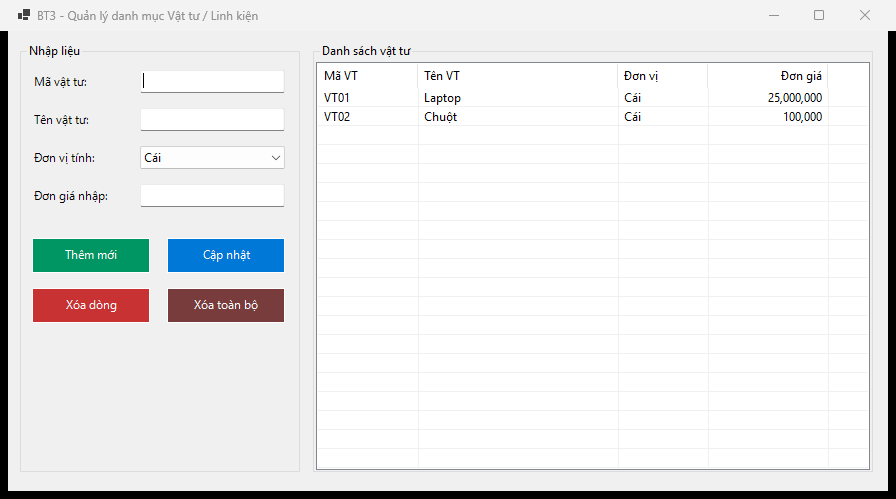
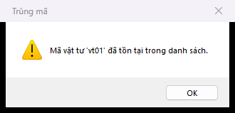

# BÁO CÁO BÀI TẬP / ĐỒ ÁN

## THÔNG TIN SINH VIÊN

- **Họ và tên:** Phạm Tuấn Thành
- **Mã số sinh viên:** 24810320264
- **Lớp:** [Chờ xác nhận lớp]
- **Tên môn học:** Lập trình C# / Windows Forms
- **Tên bài tập:** Bài 3 — Quản lý danh mục Vật tư / Linh kiện

## MÔ TẢ BÀI TẬP

Quản lý danh sách vật tư trong RAM và hiển thị bằng ListView ở chế độ Details.

- Khung nhập mã, tên, đơn vị Cái / Bộ / Kg / Mét và đơn giá.
- ListView Details, FullRowSelect, 4 cột; danh sách lấp đầy khung phải và co giãn theo cửa sổ.
- Thêm / cập nhật / xóa dòng / xóa toàn bộ; chặn mã trùng cả khi thêm lẫn cập nhật, không phân biệt hoa thường.
- Chọn dòng để nạp lại dữ liệu; giá lưu bằng decimal trong MaterialItem, không đọc ngược từ chuỗi N0.
- Xóa dòng hoặc xóa tất cả đều có xác nhận Yes/No; chọn No giữ nguyên danh sách.

## ĐỐI CHIẾU YÊU CẦU

| Mã | Nội dung đã triển khai | File chính |
|---|---|---|
| R3-1 | Khung nhập mã, tên, đơn vị Cái / Bộ / Kg / Mét và đơn giá. | `MainForm.cs` / `MainForm.Designer.cs` |
| R3-2 | ListView Details, FullRowSelect, 4 cột; danh sách lấp đầy khung phải và co giãn theo cửa sổ. | `MainForm.cs` / `MainForm.Designer.cs` |
| R3-3 | Thêm / cập nhật / xóa dòng / xóa toàn bộ; chặn mã trùng cả khi thêm lẫn cập nhật, không phân biệt hoa thường. | `MainForm.cs` / `MainForm.Designer.cs` |
| R3-4 | Chọn dòng để nạp lại dữ liệu; giá lưu bằng decimal trong MaterialItem, không đọc ngược từ chuỗi N0. | `MainForm.cs` / `MainForm.Designer.cs` |
| R3-5 | Xóa dòng hoặc xóa tất cả đều có xác nhận Yes/No; chọn No giữ nguyên danh sách. | `MainForm.cs` / `MainForm.Designer.cs` |

## CÁCH MỞ VÀ CHẠY

Yêu cầu Windows, .NET 10 SDK và Visual Studio 2026 có workload **.NET desktop development**.

1. Mở `ItemListManager.sln` bằng Visual Studio 2026.
2. Nhấn **F5** để chạy ứng dụng.
3. Để thiết kế UI: chọn `MainForm.cs` trong Solution Explorer → **Shift+F7** hoặc **View Designer**.
4. Trong Designer, **Ctrl+Alt+X** mở Toolbox. **F7** trở về code.

Chạy bằng terminal tại thư mục repo:

```powershell
dotnet restore ItemListManager.sln
dotnet build ItemListManager.sln
dotnet run --project src/ItemListManager/ItemListManager.csproj
```

UI tĩnh nằm trong `MainForm.Designer.cs`; xử lý sự kiện nằm trong `MainForm.cs`; tài nguyên form nằm trong `MainForm.resx`.

## HƯỚNG DẪN SỬ DỤNG

1. Điền mã, tên, đơn vị và giá, bấm **Thêm mới**.
2. Chọn một dòng, sửa dữ liệu rồi bấm **Cập nhật**; không được đổi sang mã của vật tư khác.
3. Chọn dòng và bấm **Xóa dòng**; chọn Yes để xóa hoặc No để giữ.
4. Bấm **Xóa toàn bộ**, xác nhận Yes để làm trống danh sách.

## KIỂM THỬ

Build bản sửa trên Windows: **0 lỗi, 0 cảnh báo**. Đã chạy 17/17 kiểm tra đạt với vi-VN. Chạy thêm 17/17 đạt với en-US.

Xem [bảng kiểm thử](./docs/TESTING.md) và [kết quả chạy](./docs/test-results.json). Kết quả tự động không thay thế việc kiểm tra kéo thả Designer và thao tác GUI ở mọi mức DPI.

## GIẢ ĐỊNH VÀ PHẠM VI

“Mết” trong đề được hiểu là “Mét”. Đơn giá > 0. Dữ liệu chỉ lưu trong RAM, mất khi đóng ứng dụng.

## KẾT QUẢ THỰC HÀNH

### 1. Giao diện chính


### 2. Chức năng thực thi / Kết quả



### 3. Kiểm tra lỗi / Validation



Thư mục `screenshots/` dùng để lưu ảnh chạy thực tế. Giữ đúng tên ảnh trên để README hiển thị trực tiếp trên GitHub.

## QUY TRÌNH NỘP VÀ PUSH

Repo đã được khởi tạo trên nhánh `main` và liên kết `origin`. Sau khi thay đổi code, README hoặc screenshot, chạy:

```powershell
git config user.name "Pham Tuan Thanh"
git config user.email "tuanthanhpham206@gmail.com"
git status
git add .
git commit -m "Nop bai tap BT3 - MSSV 24810320264 - Pham Tuan Thanh"
git push -u origin main
```

`.gitignore` bỏ qua `bin/`, `obj/`, `.vs/`, `*.user`, `*.suo`. Đăng nhập bằng Git Credential Manager; không đặt token trong URL remote hoặc mã nguồn.

## CHECKLIST TRƯỚC KHI NỘP

- [x] README có họ tên và MSSV.
- [ ] README đã điền lớp thật.
- [ ] `screenshots/` có đủ 3 ảnh chạy thực tế.
- [ ] Ảnh hiển thị trực tiếp trên trang chính GitHub.
- [x] `.gitignore` loại tệp build và cấu hình cá nhân của Visual Studio.
- [x] Repository Public.
- [x] Mã nguồn bản sửa và tài liệu đã commit/push lên nhánh `main`.
